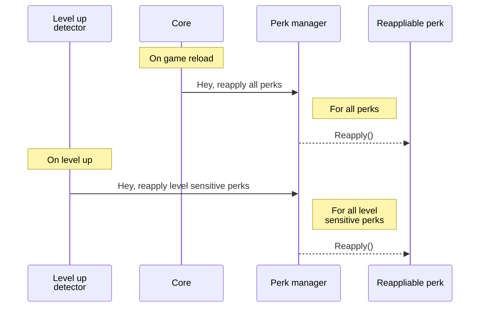

```mermaid
sequenceDiagram
participant L as Level up<br>detector
participant C as Core
participant PM as Perk manager
participant RP as Reappliable perk

Note over C: On game reload
C->>PM: Hey, reapply all perks
Note right of PM: For all perks
PM-->>RP: Reapply()

Note over L: On level up
L->>PM: Hey, reapply level sensitive perks
Note right of PM: For all level<br>sensitive perks
PM-->>RP: Reapply()

```
